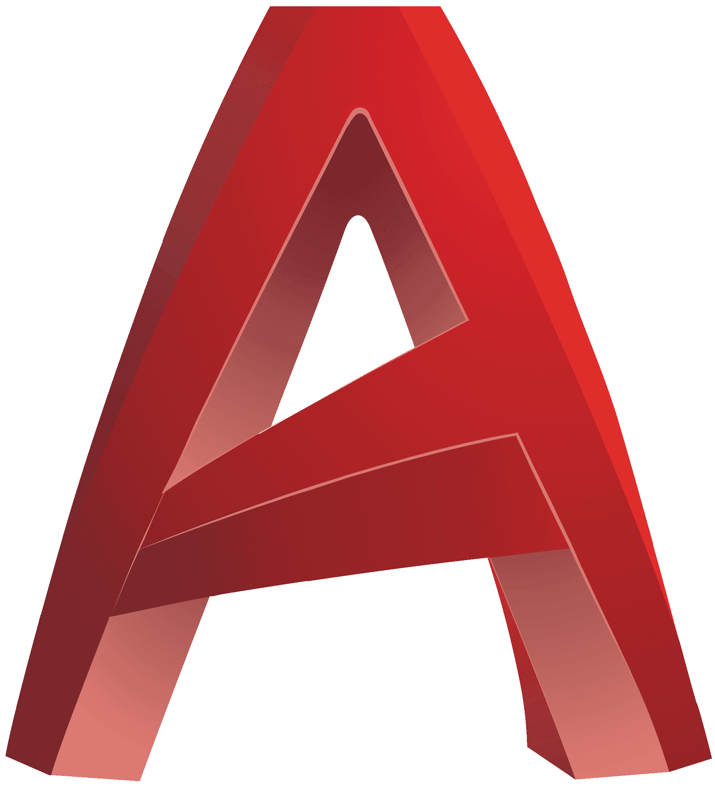

<h1>Welcome to my GitHub profile!</h1>

## About Me

My name is Alfredo Moura. I am a Computer Science student at [UNIT](https://www.unit.br/).

- 🌍 Born in São Luiz, raised in Aracaju.
- 💻 Currently, I'm learning about web development and honing my skills in HTML, CSS, JavaScript, Python, and related technologies.
- 🎓 I hold a degree in Architecture and Urbanism.
- 🛠️ I design woodworking projects.
- 🎮 I'm a huge Pokémon fan. (I can almost name them all, hehe)

## Languages and Technologies

### Bonus
(SketchUp | Revit | AutoCad)

  

  
